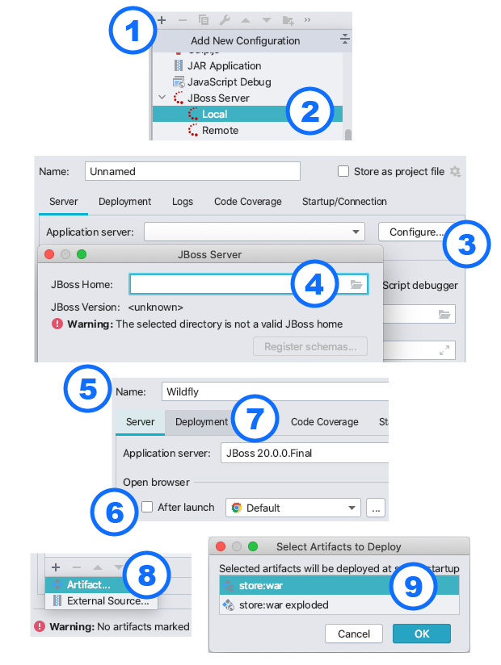

# A Modern Introduction to Java EE

This README is a summary of the following article: https://www.jessym.com/articles/a-modern-introduction-to-java-ee

## Prerequisites

 - Wildfly 20 (https://www.wildfly.org/downloads/, simply download and extract)
 - Java 11 (reason: Wildfly 20 doesn't officially support newer versions)
 - Docker
 - Intellij
 
## Wildfly Setup

 1. Via the command line, navigate to the `bin` folder of your Wildfly distribution `cd ~/Downloads/wildfly-20.0.0.Final/bin/`
 2. Create a management user via the `./add-user.sh` script where you'll be asked to provide a username and password
 3. Once the Wildfly container is running (see next steps), you'll be able to manage the container via the console at [http://localhost:9990/console/index.html](http://localhost:9990/console/index.html), using the credentials you've picked in the previous step

## Hello World
 
 1. Create an [`index.html`](./src/main/webapp/index.html) welcome page inside `src/main/webapp/`, containing a simple H1 header tag
 2. Create a [`web.xml`](./src/main/webapp/WEB-INF/web.xml) file inside `src/main/webapp/WEB-INF/` to whitelist the `index.html` file so it can be accessed
 3. Create a [`jboss-web.xml`](./src/main/webapp/WEB-INF/jboss-web.xml) file inside `src/main/webapp/WEB-INF/` to set the application's context root to something like `store`, for example

## Command Line Deployment

 1. Add the `maven-war-plugin` to your [`pom.xml`](./pom.xml) file
 2. Run `mvn package` (or `./mvnw package`) and note down the location of your `war` file (something like `target/store-1.0.0.war`)
 3. Navigate to the `bin` folder of your Wildfly distribution `cd ~/Downloads/wildfly-20.0.0.Final/bin/`
 4. Start the container via the `./standalone.sh` script
 5. From the same `bin` folder, (re-)deploy the latest version of your application via the command `./jboss-cli.sh -c --command="deploy ~/dir/to/store-1.0.0.war --force"`
 6. Visit [http://localhost:8080/store](http://localhost:8080/introduction) to view your HTML welcome page (here, `store` refers to the context root configured earlier)

## Intellij Deployment

 1. Create a new run/debug configuration via the menu "Run" -> "Edit Configurations..." and clicking the little plus (+) sign
 2. Choose JBoss Server (Local)
 3. Click to "Configure..." button to configure the application server
 4. Click the directory icon to select your unzipped Wildfly distribution (e.g.: `~/Downloads/wildfly-20.0.0.Final/`)
 5. Specify a name for the run/debug configuration (optional)
 6. Untick the open-browser-after-launch box (optional)
 7. Open the "Deployment" tab
 8. In the bottom-left corner, click the plus (+) sign and click "Artifact..." to select a deployment artifact
 9. Select the (non-exploded) WAR module of your application
 10. Click "OK", "Apply" and "Run/Debug" to start the container and deploy the latest version of your application
 11. Visit [http://localhost:8080/store](http://localhost:8080/introduction) to view your HTML welcome page (here, `store` refers to the context root configured earlier)
 

## REST Endpoints (JAX-RS)

 1. Create a class ([like this](./src/main/java/com/jessym/store/WebApplication.java)) which extends `javax.ws.rs.core.Application`
 2. Annotate the class with `@javax.ws.rs.ApplicationPath("/api")`
 3. Note that all HTTP endpoints will now be placed under `http://localhost:8080/store/api/**`, where `store` refers to the context root, and `api` refers to the application path we've just configured
 4. Follow the example of [this class](./src/main/java/com/jessym/store/resources/PingResource.java) to create a simple ping endpoint
 
## JSON Binding

 1. To return JSON from a JAX-RS endpoint, annotate the class or method with `@Produces(MediaType.APPLICATION_JSON)` (make sure to use the `javax.ws.rs` annotation)
 2. To accept JSON in a POST, PUT, PATCH or DELETE endpoint, annotate the class or method with `@Consumes(MediaType.APPLICATION_JSON)`
 
## Bean Validation

 1. For `@POST`-annotated JSON-consuming HTTP endpoints, the incoming request argument should be annotated with `@Valid` to have incoming request bodies automatically validated
 2. As shown by [this example](./src/main/java/com/jessym/store/resources/dto/RegisterAccountRequest.java), a custom request POJO can have its properties decorated by annotations like `@NotBlank`, `@Max(120)` and `@Email`

## Beans, Scopes and Injection

## Registering PostgreSQL as a Module and Data Source

 1. Download the PostgreSQL driver (JAR file) from https://jdbc.postgresql.org/download.html
 2. Navigate to the `bin` folder of your Wildfly distribution (`cd ~/Downloads/wildfly-20.0.0.Final/bin/`)
 3. Start a JBoss CLI session by running the `./jboss-cli.sh -c` command (make sure the container is running)
 4. Register PostgreSQL as a module and data source by executing the following three commands inside the CLI session:
    1. `module add --name=org.postgresql --resources=~/Downloads/postgresql-42.2.16.jar --dependencies=javax.api,javax.transaction.api`
    2. `/subsystem=datasources/jdbc-driver=postgres:add(driver-name="postgres",driver-module-name="org.postgresql",driver-class-name=org.postgresql.Driver)`
    3. `data-source add --jndi-name=java:jboss/datasources/PostgresDS --name=PostgresDS --connection-url=jdbc:postgresql://localhost:5432/postgres --driver-name=postgres --user-name=admin --password=password`
 5. TODO: verify the connection via management console

## Persistence and Entities (JPA)

## Flyway Database Migrations

## Transactions and Rollbacks
